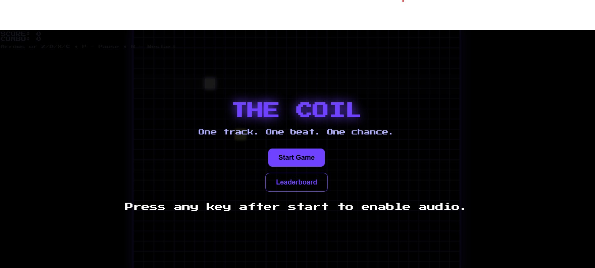
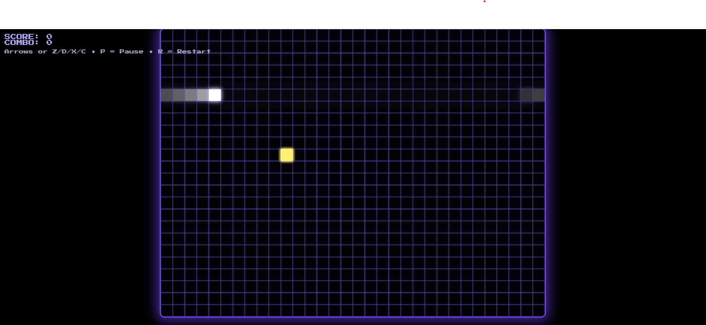

# ⚡ THE-COIL- 
> *A cyberpunk rhythm snake web game where beats decide your fate.*


---

## 🎮 Game Overview  
**The Coil** isn’t your grandma’s snake game.  
It’s a *neon-drenched rhythm challenge* where you move to the beat —  
eat the glowing orbs (your “mice”) in sync with the music,  
or watch your combo streak fade into the void.  

Every milestone amps up the difficulty.  
The grid pulses, obstacles rise, and your reflexes melt under the cyberpunk glow.

---

## 🕹️ Controls  
| Key | Action |
|-----|--------|
| ⬆ / D | Move Up |
| ⬇ / X | Move Down |
| ⬅ / Z | Move Left |
| ➡ / C | Move Right |
| P | Pause |
| R | Restart |

---

## 🔊 Music  
The game runs on a **single background track** that syncs with movement.  
Custom BGM supported — drop your `.mp3` file in the `assets/` folder and rename it to `track1.mp3`.  

---

## 🌈 Visual Theme  
- Pixel-perfect **retro grid**  
- Glowing **white snake** and **neon yellow orbs**  
- Dynamic **purple-blue glow borders**  
- Ambient grid shimmer synced to rhythm  

---

## 🧠 Tech Stack  
- **HTML5 Canvas** — rendering grid and visuals  
- **JavaScript (Vanilla)** — game logic, movement, music sync  
- **CSS3** — neon theme and glow effects  
- **GitHub Pages** — deployment  

---
## 🖥️ User Interface
 

| Start | Play | Game Over |
|-------|------|------------|
|  |  |  |


## 🚀 How to Run Locally
```bash
git clone https://github.com/Mystic-learner/The-Coil-.git
cd The-Coil-
open index.html
